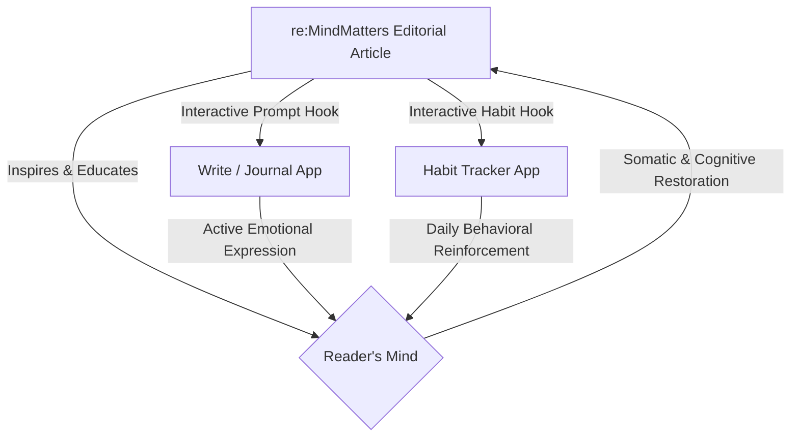

# re:MindMatters — Editorial Content Philosophy

## Core Editorial Mission

re:MindMatters exists to deliver high-quality, scientifically grounded, and forward-thinking self-care content with strictly positive vibes.

The platform provides a restorative ecosystem where editorial reading materials are paired directly with actionable daily tools. Every article, essay, or guide is designed to not only educate the reader, but to immediately engage their agency through connected journaling prompts (in the **Write app**) and habit modifications (in the **Habit Tracker app**).

We approach mental health as an active, interconnected ecosystem influenced by:
- personal cognitive patterns
- physical and somatic habits
- environmental spaces
- digital hygiene and social boundaries

---

# Content Taxonomy

Content on re:MindMatters is strictly organized into four specific content forms, ensuring a structured, predictable, and cohesive layout:

## 1. Essays (Deep-Dive Reflections)
Long-form, engaging, and deeply atmospheric narrative pieces that combine personal human storytelling with the latest insights from cognitive science, positive psychology, and neurobiology.
- **Goal**: Build deep cognitive understanding, normalize internal struggle, and inspire long-term mindset shifts.
- **Example**: An essay exploring *neuroplasticity and the cognitive mechanics of self-compassion*, showing how the brain physically rewires itself when we alter our internal dialogue.

---

## 2. Guides (Actionable Self-Care Step-by-Steps)
Highly practical, step-by-step cognitive and somatic exercises that give the reader immediate tools to process emotions, reduce stress, or restore balance.
- **Goal**: Immediate emotional and physical regulation.
- **Example**: A step-by-step guide to *Mindful Senses Grounding (the 5-4-3-2-1 technique)* or *Structuring Constructive Cognitive Re-framing Worksheets*.

---

## 3. News (Optimistic Scientific Breakthroughs)
Short to medium-form reporting on positive, forward-thinking developments in psychology, neuroscience, social well-being, and workspace mental health.
- **Goal**: Inspire hope, counter media-driven pessimism, and ground our optimistic worldview in credible, ongoing scientific progress.
- **Example**: A news update highlighting a major study on *how regular green-space exposure reduces physiological markers of chronic stress*.

---

## 4. Vibes (Micro-Reflections & Prompts)
Bite-sized, poetic, and highly atmospheric micro-thoughts centered around a single theme, paired directly with an interactive prompt.
- **Goal**: Quick daily re-centering, perfect for starting a journaling session.
- **Example**: A micro-reflection on *the quiet beauty of slow mornings*, paired with a prompt that loads instantly into the editor.

---

## 5. Tagging Taxonomy
To maintain clean category organization and searchability, articles are tagged using a strict canonical model of Topics, Conditions, Techniques, and Meta content formats. For rules and the permitted canonical set, see [spec/TAGGING.md](file:///home/jk/Code/Astro/spec/TAGGING.md).

---

# Client-Side Application Integration

To prevent self-care from being a passive reading activity, re:MindMatters content is structurally integrated with our two key functional apps:

## 1. The Write / Journal App Integration
* **Mechanism**: Every Essay, Guide, or Vibe article concludes with an interactive **"Send Prompt to Journal"** action button.
* **Behavior**: Clicking this button instantly opens the **Write/Journal app** with the cursor placed in the title, and seeds the editor canvas with a tailored reflection prompt.
* **Purpose**: Allows the user to immediately express, analyze, and integrate the article's concept in a private, distraction-free environment.

## 2. The Habit Tracker App Integration
* **Mechanism**: Guides and Essays conclude with a **"Track This Habit"** action button.
* **Behavior**: Clicking this button automatically adds a new, micro-measurable habit (e.g., "5-min morning breathing," "No screens after 10 PM") to the user's active **Habit Tracker app** dashboard.
* **Purpose**: Helps the user translate cognitive insights into small, recurring daily actions that build lasting neural pathways.

---

# The strictly positive vibes framework

We write strictly positive vibes. However, this is not "toxic positivity." We must strictly distinguish the two:

| Toxic Positivity (Prohibited) | Strictly Positive Vibes (re:MindMatters Standard) |
|---|---|
| Denies or shames feelings of sadness, fear, or anxiety. | Fully validates struggle, sorrow, and pain with empathy. |
| Tells the reader to "just be happy" or "ignore the bad." | Explains the underlying systems of stress, and guides healing. |
| Minimizes structural, environmental, or personal trauma. | Respects the difficulty of constraints while empowering personal agency. |
| Ends in empty platitudes ("Good vibes only!"). | Ends in actionable cognitive re-framing, habits, and pathways of hope. |

Every piece of content must:
1. **Validate**: Meet the reader where they are with absolute compassion and emotional safety.
2. **De-mystify**: Explain the science or patterns of what they are experiencing (e.g. why the nervous system wiggles under stress).
3. **Empower**: Provide a strictly positive, hopeful, and actionable framework for moving forward.

---

# Content Formatting Standards

To ensure clean editorial readability, all content must adhere to these formatting rules:
- **Maximum Reading Width**: The text column must never exceed `680px` (or `42.5rem`) to ensure optimal reading focus and eye tracking.
- **Section Breaks**: Long-form pieces must be broken up every 400–500 words using editorial subheadings (`h2`, `h3`) or quiet dividers.
- **Archival Pull Quotes**: Use beautiful, indented serif blockquotes to highlight key takeaways or soothing quotes.
- **Sensory Grounding**: Include concrete descriptions of touch, sight, breathing, or physical environment to anchor abstract psychological concepts.
